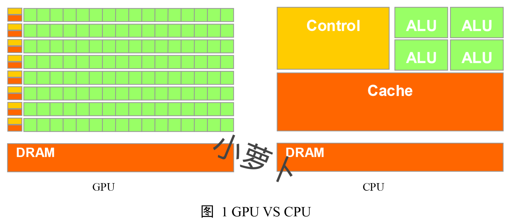
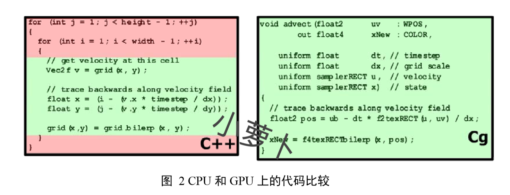

## 第一章  绪论

> 面纱掩盖了过去、现在和将来，历史学家的使命是发现它现在是什么，而不是过去是什么。
　　　　　　　　　　　　　　　　　　　　　　　　　------ [Henry David Thoreau]
                                         
### 1.1 Programmable Graphics Processing Unit 发展历程

&#x2003;Programmable Graphics Processing Unit(GPU)，即可编程图形处理单元，通常也称只为可编程图形硬件。
 
 
&#x2003;GPU 概念在 20 世纪 70 年代末和 80 年代初被提出，使用单片集成电路（monolithic）作为图形芯片，此时的 GPU 已经被用于视频游戏和动画方面，它能够很快地进行几张图片的合成（仅限于此）。在 20 世纪 80 年代末到 90 年代初这段时间内，基于数字信号处理芯片（digital signal process chip）的GPU被研发出来，与前一代相比速度更快、功能更强，当然价格是非常的昂贵。在 1991 年，S3 Graphics公司研制出第一个单芯片 2D 加速器，到了 1995 年，主流的 PC 图形芯片厂商都在自己的芯片上增加了对 2D 加速器的支持。于此同时，固定功能的视图加速器（fixed-function Windows accelerators）由于其高昂的价格而慢慢推出 PC 市场。
  
&#x2003;1998 年 NVIDA 公司宣布 modern GPU 研发成功，标志这 GPU 研发的历史性突破成为现实。通常将 20 世纪 70 年代末到 1998 年的这一段时间称之为pre-GPU 时期，而自 1998 年往后的 GPU 称之为 modern GPU。在 pre-GPU 时期，一些图形厂商，如 SGI、Evans & Sutherland，都研发了各自的 GPU，这些 GPU 在现在并没有被淘汰，依然在持续改进和被广泛的使用，当然价格也是非常的高昂。
  
&#x2003;modern GPU 使用晶体管（transistors）进行计算，在微芯片（microchip）中，GPU 所使用的晶体管已经远远超过 CPU，例如，Intel 在 2.4GHz 的 Pentium IV 上使用5 千 5 百万（55 million）个晶体管；而 NVIDIA 在 GeForce FX GPU 上使用超过 1 亿 2 千 5 百万（125 million）个晶体管，在 NVIDDIA 7800 GXT 上的晶体管达到 3 亿 2 百万（302 million）个。
  
&#x2003;回顾 Modern GPU 的发展历史，自 1998 年后可以分为 4 个阶段。NVIDIA 于 1998 年宣布 Modern GPU 研发成功，这标志第一代 Modern GPU 的诞生，第一代 Modern GPU 包括 NVIDIA TNT2，ATI 的 Rage 和 3Dfx 的 Voodoo3。这些 GPU 可以独立于 CPU 进行像素缓存区的更新，并可以光栅化三角面片以及进行纹理操作，但是缺乏三纬顶点的空间坐标变换能力，这意味着“必须依赖于 GPU 执行顶点坐标变换的计算”。这一时期的 GPU 功能非常有限，只能用于纹理组合的数学计算或者像素颜色值的计算。
  
&#x2003;从 1999 到 2000 年，是第二代 modern GPU 的发展时期。这一时期的 GPU 可以进行三纬坐标转换和光照计算（3D Object Transformation and Lighting T&L），并且 OpenGL 和 DirectX7 都提供了开发接口，支持应用程序使用基于硬件的坐标变换。这是一个非常重要的时期，在此之前只有高级工作站（workstation）的图形硬件才支持快速的顶点变换。同时，这一阶段的 GPU 对于纹理的操作也扩展到了立方体纹理（cube map）。NVIDIA 的 GeForce256，GeForceMAX，ATI 的 Radeon7500 等都是在这一阶段研发的。
  
&#x2003;2001 年是第三代 modern GPU 的发展时期，这一时期研发的 GPU 提供vertex programmability （顶点编程能力），如GeForce 4Ti，ATI 的 8500 等。这些 GPU 允许应用程序制定一个序列的指令进行顶点操作控制（GPU 编程的本质！），这同样是一个具有开创意义的时期，这一时期确立的 GPU 编程思想一直延续到 2009 年的今天，不但深入到工程领域帮助改善人类日常生活（医疗、地质勘探、游戏、电影等），而且开创或延伸了计算机科学的诸多研究领域（体绘制、光照模型、人群动画、通用计算等）。同时，Direct8 和 OpenGL 都本着与时俱进的精神，提供了支持 vertex programmability 的扩展。不过，这一时期的 GPU 还不支持像素级的编程能力，即 fragment programmability （片段编程能力），在第四代 modern GPU 时期，我们将迎来同时支持 vertex programmability 和 fragment programmability 的 GPU。
  
&#x2003;第四代 mondern GPU 的发展时期从 2002 年末到 2003 年。NVIDIA 的 GeForce FX 和 ATI Radeon9700 同时在市场的舞台上闪亮登场，这两种 GPU 都支持 vertex programmablility 和 fragment programmability。同时 DirectX 和 OpenGL 也扩展了自身的 API，用以支持 vertex programmablility 和 fragment programmability。自 2003 年起，可编程图形硬件正式诞生，并且由于 DirectX 和 OpenGL 契而不舍的追赶潮流，导致基于图形硬件的编程技术，简称 GPU 编程，也宣告诞生。恭喜 GeForce 和 ATI 的硬件研发人员，你们终于可以歇口气了，不用较着劲的出显卡了，同时也恭喜 DirectX 和 OpenGL 的研发人员，你们也可以休息下了，不用斗鸡一般的工作了，最后恭喜广大工作在图形图像领域的程序员，你们可以继续学而不倦。
  
&#x2003;目前最新的可编程图形硬件已经具备了如下功能：
  
&#x2003;1. 支持 vertex programmablility 和 fragment programmability；
 
&#x2003;2. 支持 IEEE32 位浮点数运算；
 
&#x2003;3. 支持 4 元向量，4 阶矩阵计算；
 
&#x2003;4. 提供分之指令，支持循环控制语句；
 
&#x2003;5. 具有高带宽的内存传输能力（>27.1GB/s）；
 
&#x2003;6. 支持 1D、2D、3D 纹理像素查询和使用，且速度极快；
 
&#x2003;7. 支持绘制到纹理功能（Render to Texture，RTT）；
  
&#x2003;关于 GPU 发展历史的相关数据参考了Feng Liu 的“Platform Independent Real-time X3D Shaders and Their Applications in Bioinformatics Visualization”一文

### 1.2 GPU VS CPU

&#x2003;从上节阐述了 GPU 的发展历史，那么为什么在 CPU 之外要发展 GPU？GPU 的 vertex programmability 和 fragment programmability 究竟在何处有着怎样的优势？引用在文献【2】第6页的一段话为：
 
> Modern GPUs implement a number of graphics primitive operations in a way that make running them much faster than drawing directly to the screen with the host CPU. They are efficient at manipulating and displaying computer graphics, and their highly parallel structure makes them more effective than typical CPUs for a range of complex algorithms.

&#x2003;这段话的意思是，由于 GPU 具有高并行结构（highly parallel stucture），所以 GPU 在处理图形数据和复杂算法方面拥有比 CPU 更高的效率。图 1 GPU VS CPU 展示了 GPU 和 CPU 在结构上的差异，CPU 大部分面积为控制器和寄存器，与之相比，GPU 拥有更多的 ALU （Arithmetic Logic Unit，逻辑运算单元）用于数据处理，而非数据高速缓存和流控制，这样的结构适合对密集型数据进行并行处理。CPU 执行计算任务时，一个时刻处理一个数据，不存在真正意义上的并行（请回忆 OS 教程上的时间片轮转算法），而 GPU 具有多个处理核，在一个时刻可以并行处理多个数据。
  

&#x2003;GPU 采用流式并行计算模式，可对每个数据进行独立的并行计算，所谓“对数据进行独立计算”，即，流内任意元素的计算不依赖于其它同类型数据，例如，计算一个顶点的世界位置坐标，不依赖于其他顶点的位置。而所谓“并行计算”是指“多个数据可以同时被使用，多个数据并行运算的时间和 1 个数据单独执行的时间是一样的“。图 2 中代码目的是提取 2D 图像上每个像素点的颜色值，在 CPU 上运算的 C++ 代码通过循环语句一次遍历像素；而在 CPU 上，则只需要一条语句就足够。
  

&#x2003;可能有人会问道：即然 GPU 在数据处理速度方面远胜 CPU，为什么不用 GPU 完全取代 CPU 呢？ 实际上，关于 GPU 取代 CPU 的论调时有出现，但是作者本人不同意这种观点，因为 GPU 在寻多方面与 CPU 相比尚有不如。
  
&#x2003;首先，虽然 GPU 采用数据并行处理方式极大加快了原算速度，但正是由于“任意一个元素的计算不依赖于其它同类型数据”，导致“需要知道数据之间相关性的”算法，在 GPU 上难以得到实现（但在 CPU 上则可以方便的实现），一个典型的例子是射线与不规则物体的求交运算。
  
&#x2003;此外，GPU 在控制流方面弱于 CPU，在图中可以看到，GPU 中的控制器少于 CPU，而控制器的主要功能是取指令，并指出下一条指令在内存中的位置，控制和协调计算机的各个部件有条不紊地工作。在早期的 OpenGL fp2.0，fp3.0 以及 FirectX 的 ps_4_0 之前的 profile 版本都不支持或不完全支持循环控制流语句（目前在软硬件方面都已得到改进）。由于 GPU 编程完全依赖于图形硬件，故而较早版本的 GPU 并不支持一些常用的编程需要，而现在很多个人电脑或者公司的电脑的更新换代并没有那么快（考虑个人电脑的使用寿命在 4-6 年，所以在 2012 之后，旧式显卡的更新换代会基本结束 ），这也制约了 GPU 编程技术的使用。
  
&#x2003;最后进行 GPU 编程必须掌握计算机图形学相关知识，以及图形处理 API，入门门槛较高，学习周期较长，尤其国内关于 GPU 编程的资料较为匮乏，这些都导致了学习的难度。在早期，GPU 编程只能使用会变语言，开发难度高、效率低、不过，随着高级 Shader  language 的兴起，在 GPU 上编程已经容易多了。

### 1.3 国内外研究现状

&#x2003;基于 GPU 的科学可视化计算（Visualization in Scientific Computing），在研究和工程运用上都取得了卓越的成果。由于科学可视化计算处理的数据量极大（人体 CT、地质勘探、气象数据、流体力学等），仅仅基于 CPU 进行计算完全不能满足实时性要求，而在 GPU 上进行计算则可以在效率上达到质的突破，许多在 CPU 上非常耗时的算法，如体绘制中的光线投射算法，都可以成功移植到 GPU 上，所以基于 GPU 的科学可视化研究目前已经成为主流。
  
&#x2003;近年来，基于 GPU 进行通用计算的研究逐渐成为热点，被称之为 GPGPU（General-Purpose Computing on Graphics Processing Units，也被称为 GPGP，或 GP的平方），很多数值计算等通用算法都已经在 GPU 上得到了实现，并有不俗的性能表现，目前，线性代数（linear algebra）【kruger and westermann 2003】，物理仿真（physical simulation）【Harris et al. 2003】和光线跟踪算法（ray tracer）【Purcell et al. 2002; Carr et al. 2002】都已经成功的移植到 GPU 上。在国内，中国科学院计算技术研究所进行了基于 GPU 的串匹配算法的实现【29】。关于 GPGPU 的更多知识点可以参阅网站
  
&#x2003;旨在降低 GPU 编程难度，设计基于 GPU 的高级程序语言的研究同样进行的如火如荼。2004 年，斯坦福大学研究的 BROOKGPU 项目设计了一个实时的编译器，编程人员不需要掌握图形学知识，只需掌握与 C 语言类似的流处理语言 BROOK，即可进行基于 GPU 的通用编程开发。目前 BROOKGPU 已经在 AMD 公司进行深入研发。国内浙江大学计算机学院针对高级着色语言的编译系统【30】，以及可编程图形硬件的加速等技术进行了研究。

### 1.4 本书主要内容和结构

&#x2003;本书旨在引导初级 GPU 学习者步入 GPU 编程的大堂，并普及一些在国内资料较少见到的 GPU 算法，例如光照渲染中的 bank BRDF，以及体绘制中的光线投射（ray-casting）算法。在 GPU 编程方面有一定基础的童鞋，可以将本书的一些观点作为参考。～_～
  
&#x2003;本书并非网络小说，也非“立意新奇，饰以深奥文字，佐以华丽图表的国际论文”，而是作者有感于国内 GPU 研究现状堪忧，而抛砖引玉之作，故而以通俗的语言说出自己明白的事情，是我写作的原则。
  
&#x2003;本书的框架划分，也是希望可以循序渐进、深入浅出的让大家了解 GPU 世界。
  
&#x2003;本书由四大部分组成，第一部分阐述“GPU 的发展历史、GPU 和 CPU 的优劣比较、GPU 的图形绘制管线，以及在 GPU 上使用的 shader language”，这一部分由 3 章组成，GPU 图形绘制管线描述了 GPU 的工作原理，这部分知识是 GPU 编程的铸基之石；而 Shader Language 章节阐述了 vertex program （顶点编程）和 fragment program（片段编程）在 GPU 管线中的位置、作用和工作机制。
  
&#x2003;本书的第二部分讲述 CG 语言的使用方法，由五章组成（第四章到第八章）。这部分的知识以 NVIDIA 出版的 The Cg Tutorial The Definitive Guide to Programmable Real-Time Graphics 和 Cg ToolKit Usr‘s Manual 作为基础，并加入了作者本人在实践中的一些总结。The Cg Tutorial The Definitive Guide to Programmable Real-Time Graphics 已经有了中文版本，名为《Cg 教程--可编程实时图形权威指南》，不过个人觉得，由于此书的英文原版在组织形式上有些不合理之处，且在知识点上并不完善，故此，并不推荐初学者先阅读此书。Cg ToolKit User‘s Manual 一书，目前还没有中文版（却存在日文版）（__2019年9月26日 Google 搜索了一下，已经支持中文版__），此书在语法的阐述上胜于前者，英文好的读者可以尝试着阅读一下英文原版。
  
&#x2003;本书的第三部分阐述光照模型的知识，由三章组成（第九章到第十一章）。这部分首先以较为简单的光照模型作为 GPU 编程的实践理论，让读者从实际编程中学习 Cg 语言的使用方法，然后介绍较为高级的 BRDF 光照模型，以及透明光照模型。BRDF 光照模型的知识点在国内的书籍中不常见，实际代码更是没有看到过（其实随着游戏行业的发展，U3D、UE4逐渐成熟，BRDF 已经不在那么神秘），希望这一章节对这方面的研究人员略有帮助（__主要是想探究原理的读者，因为商业引擎知识提供了便于设计人员或者开发人员使用 BRDF 的手段，并没有提及原理和实现，但是有很多开发者基于 U3D 和 UE4 引擎助力分享了 BRDF 的 Shader 实现__）。
  
&#x2003;本书的第四部分针对投影纹理映射和阴影算法进行讲解，由两章组成（第十二章和第十三章），这部分的知识希望可以引起大家足够的重视，因为投影纹理映射和深度值的使用方法，都是既基础又重要的知识，在更高一级的前沿研究课题（图体绘制、软阴影渲染）中经常被使用。
  
&#x2003;本书的第五部分阐述了体绘制知识点以及基于 GPU 的光线投射算法。体绘制是我花费研究时间较多的地方，不但因为技术本身较为复杂，而且因为体数据手机和使用较为困难。体绘制技术的中文资料少之又少，优秀硕博士论文库上一般是人云亦云，可能高手都比较含蓄，所以我姑且写出两篇，如有可用之处，则可慰我心，如不堪入目，聊供方家一笑（__读者在写这些的时候还比较早，那个年代关于体绘制地 文章确实不多，其实现在也不是很多，不过像 U3D 和 UE4 已经比较完善的支持了这些能力__）。

