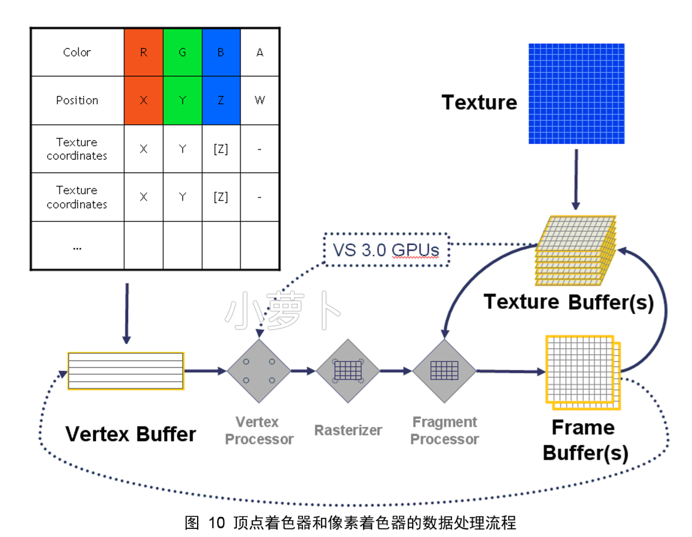

## 第03章  Shader Language
 

> 我们全都要从前辈和同辈学习到一些东西。就连最大的天才，如果想单凭他所特有的内在自我去对付一切，他也决不会有多大成就。 
　　　　　　　　　　　　　　　　　　　　　　　　　　　　　　　　　　　------ 歌德

　　In the last year I have never had to write a single HLSL/GLSL shader. Bottom line, I can't think of any reason NOT to use CG.
  
　　Shader Language, 称为着色语言，Shader 在英语中的意思是阴影、颜色深浅的意思，Wikipedia 上对 Shader Language 的解释为“The job of a surface shading procedure is to choose a color for each pixel on a surface, incorporating any variations in color of the surface itself and the effects of lights that shine on the surface(Marc Olano)”, 即，Shader Language 基于物体本身属性和光照条件，计算每个像素的颜色值。
  
　　实际上这种解释具有明显的时代局限性，在 GPU 编程发展的早期，Shader Language 的提出目标是加强对图形处理算法的控制，所以对该语言的定义亦针对于此。但对这技术的进步，目前的 Shader Language 早已经用于通用计算研究。
  
　　Shader Language 被定为为高级语言，如，GLSL 的全称是“High Level Shading Language”，Cg 语言的全称为“C for Graphic”，并且这两种 Shader Language 的语法设计非常类似于 C 语言。不过高级语言的一个重要特性是“独立于硬件”，在这一方面 Shader Language 暂时还做不到，Shader Language 完全依赖于 GPU 架构，这一特征在现阶段是非常明显的！任意一种 Shader Language 都必须基于图形硬件，所以 GPU 编程技术的发展本质上还是图形硬件的发展。在 Shader Language 存在之前，展示基于图形硬件的编程能力只能靠低级的汇编语言。
  
　　目前，Shader Language 的发展方向是设计出编辑性方面可以和C++\JAVA相比的高级语言，“赋予程序员灵活而方便的编程方式”，并“尽可能的控制渲染过程”同时“利用图形硬件的并行性，提高算法的效率”。Shader Language 目前主要有 3 种语言：基于 OpenGL 的GLSL，基于 Direct3D 的HLSL，还有 NVIDIA 公司的 Cg 语言。
  
　　本章的目的是阐述 Shader Language 的基本原理和运行流程，首先从硬件的角度对 Programmable Vertex Processor（可编程顶点处理器，又称为顶点着色器）和Programmable Fragment Processor（可编程片断处理器，又称为片断着色器）的作用进行阐述，然后再此基础上对 Vertex Program 和 Fragment Program 进行具体论述，最后对 GLSL、HLSL 和 Cg 进行比较。
 

### 3.1 Shader Language 原理

　　使用 Shader Language 编写的程序称之为  Shader Program （着色程序）。着色程序分为两类：vertex shader program （顶点着色程序）和 fragment shader program （片断着色程序）。为了清楚的解释顶点着色和片断着色的含义，我们首先从阐述 GPU 上的两个组件开始：Programmable Vertex Processor（可编程顶点处理器，又称为顶点着色器）和 Programmable Fragment Processor（可编程片断处理器，又称为片断着色器）。文献【2】第 1.2.4 节中论述到：
  
　　The Vertex and Fragment processing broken out into programmable units. The Programmable vertex processor is the hardware unit that runs your Cg Vertex programs, whereas the programmable fragment processor is the unit that runs your Cg fragment programs.
  
　　这段话的含义是：顶点和片断处理器被分离成可编程单元，可编程顶点处理器是一个硬件单元，可以运行顶点程序，而可编程片段处理器则一个可以运行片段程序的单元。
  
　　顶点和片段处理器都拥有非常强大的并行计算能力，并且非常擅长于矩阵（不高于 4 阶）计算，片段处理器还可以高速查询纹理信息（目前顶点处理器还不行，这是顶点处理器的一个发展方向）。
  
　　如上所述，顶点程序运行在顶点处理器上，片段程序运行在片断处理器上，那么他们究竟控制了 GPU 渲染的哪个过程。图 8 展示了可编程图形渲染管线。
  

 
　　对比上一章图 3 中的 GPU 渲染管线，可以看出，顶点着色器控制顶点坐标转换过程；片段着色器控制像素颜色计算过程。这样区分出顶点着色器程序和片段着色器程序的各自分工；Vertex Program 负责顶点坐标转换；Fragment Program 负责像素颜色计算；前者的输出是后者的输入。
  
　　图 9 展示了现阶段可编程图形硬件的输入\输出。输入寄存器存放输入的图元信息；输出寄存器存放处理后的图元信息；纹理 Buffer 存放纹理数据，目前大多数的可编程图形硬件只支持片段处理器处理纹理；从外部宿主程序输入的常量放在常量寄存器中；临时寄存器存放着色程序在执行过程中产生的临时数据。

  

 

### 3.2 Vertex Shader Program

　　Vertex Shader Program（顶点着色程序）和 Fragment Shader Program（片段着色程序）分别被 Programmable Vertex Processor（可编程顶点处理器）和 Programmable Fragment Processo （可编程片段处理器）所执行。
  
　　顶点着色程序从 GPU 前端模块（寄存器）中提取图元信息（顶点位置、法向量、纹理坐标等），并完成顶点坐标空间转换、法向量空间转换、光照计算等操作，最后将计算好的数据传送到指定寄存器中；然后片段着色程序从中获取需要的数据，通常为“纹理坐标、光照信息等”，并根据这些信息以及从应用程序传递的纹理信息（如果有的话）进行每个片断的颜色计算，最后将处理后的数据送到光栅操作模块。
  
　　图 10 展示了在顶点着色器和像素着色器的数据处理流程。在应用程序中设定的图元信息（顶点位置坐标、颜色、纹理坐标等）传递到 Vertex Buffer 中；纹理信息传递到 Texture Buffer 中。其中虚线表示目前还没有实现的数据传递。当前的顶点程序还不能处理纹理信息，纹理信息只能在片断程序中读入。
  
　　顶点着色程序与片断着色程序通常是同时存在，相互配合，前者的输出作为后者的输入。不过，也可以只有顶点着色程序。如果只有顶点着色程序，那么只对输入的顶点进行操作，而顶点内部的点则按照硬件默认的方式自动插值。例如，输入一个三角面片，顶点着色程序对其进行 Phong 光照计算，只计算三个顶点的光照颜色，而三角面片内部点的颜色按照硬件默认的算法（Gourand 明暗处理或者快速 Phong 明暗处理）进行插值，如果图形硬件比较先进，默认的处理算法较好（快速 Phong 明暗处理），则效果也会较好；如果图形硬件使用 Gourand 明暗处理算法，则会出现马赫带效应（条带花）。

>　　Phong着色法，三维电脑图像的绘图技巧之一，结合了多边形物体表面反射光的亮度，并以特定位置的表面法线作为像素参考值，以插值方式来估计其他位置像素的色值。 
　　这个方法由美国越南裔学者裴祥风发明，于1973年的博士论文首度发表。 
　　Phong着色法与Gouraud着色法比较，Phong着色法的效果更逼真，能够提供更好的光滑曲面的近似值。Phong着色法假设一个平滑变化的曲面为一矢量。在对于有较小的高光曲线区的反射模型，例如PHONG模型时，Phong着色法比Gouraud着色法更优。但运算程序也比前者为复杂。Gouraud着色法在遇到在较大的多边形模型中央有高光曲线区时会产生严重的问题。因为这些高光曲线区在多边形的顶点处会产生缺失，而Gouraud着色法是基于顶点的颜色的，这些高光曲线区会从多边形的内部缺失。这个问题在Phong着色法中得到了解决。不同于通过多边形差值的Gouraud着色法，Phong着色法中一个矢量是从多边形顶点的法线到多边形表面进行差值的。为了或得到最后的像素颜色，面的法线被差值，应用于一个反射模型。由于Phong着色法需要逐像素点进行计算，因此运算量远大于Gouraud着色法。
 

>　　所谓“马赫带效应（Mach band effect）”是指视觉的主观感受在亮度有变化的地方出现虚幻的明亮或黑暗的条纹，马赫带效应的出现是人类的视觉系统造成的。生理学对马赫带效应的解释是：人类的视觉系统有增强边缘对比度的机制。
 
　　而片段着色程序是对每个片段进行独立的颜色计算，并且算法由自己编写，不但可控性好，而且可以达到更好的效果。
  
　　由于 GPU 对数据进行并行处理，所以每个数据都会执行一次 Shader 程序。即，每个顶点数据都会执行一次顶点程序；每个片段都会执行一次片段程序。

  

 

### 3.3 Fragment Shader Program

　　片段着色程序对每个片段进行独立的颜色计算，最后输出颜色值的就是该片段最终显示的颜色。可以这样说，顶点着色程序主要进行几何方面的运算，而片段着色程序主要针对最终的颜色值进行计算。
  
　　片段着色程序还有一个突出的特点是：拥有检索纹理的能力。对于 GPU 而言，纹理等价于数组，这意味着。如果做通用计算，例如数组排序、字符串检索等，就必须使用到片段着色程序。让顶点着色器也拥有检索纹理的能力，是目前的一个研究方向。
  
　　附：什么是片段？片段和像素有什么不一样？所谓片段就是所有的三维顶点在光栅化之后的数据集合，这些数据还没有经过深度值比较，而屏幕显示的像素都是经过深度比较的。
 

### 3.4 CG VS GLSL VS HLSL

　　Shader Language 目前有 3 种主流语言（其实现在更多了，该死的苹果大大对 OpenGL 下手了）：基于 OpenGL 的 GLSL（OpenGL Shading Language，也称为 GLslang），基于 Direct3D 的 HLSL（High Level Shading Language），还有 NVIDIA 公司的 Cg (C for Graphic) 语言。
  
　　GLSL 与 HLSL 分别是基于 OpenGL 和 Direct3D 的接口，两者不能混用，事实上 OpenGL 和 Direct3D 一直都是冤家对头，曹操和刘备还有一段和平共处的甜美时光，但是 OpenGL 和 Direct3D 各自的东家则从来都是争斗不休。斗争良久，既然没有分出胜负，那么必然是两败俱伤的局面。
  
　　首先 ATI 系列显卡对 OpenGL 扩展支持不够，例如我在使用 OSG（Open Scene Graphic）开源图形引擎时，由于该引擎完全基于 OpenGL，导致其上编写的 3D 仿真程序在较老的显卡上常常出现纹理无法显示的问题。其次 GLSL 的语法体系自成一家，而 HLSL 和 Cg 语言的语法基本相同，这就意味着，只要学习 HLSL 和 Cg 中任何一种，就等同于学习了两种语言。不过 OpenGL 毕竟是图形 API 曾经的领袖，通常介绍 OpenGL 都会附加上一句 “事实上的工业标准”，所以在其长期发展中积累下的用户群庞大，这些用户当然会选择 GLSL 学习。此外，GLSL 集成了 OpenGL 的良好移植性，一度在 unix 等操作系统上独领风骚（已是曾经的往事）。
  
　　微软的 HLSL 移植性较差，在 Windows 平台上可谓一家独大，可一出自己的院子（还好院子够大），就是落地凤凰不如鸡。这一点在很大程度上限制了 HLSL 的推广和发展。目前 HLSL 多半都是用于游戏领域。我可以负责任的断言，在 Shader Language 领域，HLSL 可以凭借微软的老本称为割据一方的诸侯，但，绝不可能称为君临天下的霸主。这和微软现在的局面很像，就是一个被带刺鲜花簇拥着的大财主，富贵已极，寸步难行。
  
　　上面两个大佬打得很热烈，在这种情况下可以用一句俗话来形容，“鹬蚌相争，渔翁得利”。NVIDIA 是现在当之无愧的显卡之王（尤其在 AMD 兼并 ATI 之后），是 GPU 编程理论的奠基者，GeForce 系列显卡早已深入人心，它推出的 Cg 语言已经取得了巨大的成功，生生形成了三足鼎立之势。NVIDIA 公司深通广告知道，目前最流行的 GPU 编程精髓一书就出自该公司，书中不但介绍了大量的 GPU 前沿知识，最重要的是大部分都要 Cg 语言实现。凭借该系列的书籍，NVIDIA 不光确定了在青年学子间的学术地位，而且成功的推广了 Cg 语言。我本人就是使用 Cg 语言进行研发，基于如下理由：
  
　　其一，Cg 是一个可以被 OpenGL 和 Direct3D 广泛支持的图形处理器编程语言。Cg 语言和 OpenGL、DirectX 并不是同一层次的语言，而是 OpenGL 和 DirectX 的上层，即，Cg 程序是运行在 OpenGL 和 DirectX 标准顶点和像素着色的基础上的；
  
　　其二，Cg 语言是 Microsoft 和 NVIDIA 相互协作在标准硬件光照语言的语法和语义上达成了一致，文献【1】在 1.3.1 节的标题就是“Microsoft and NVIDIA's Collaboration to Develop Cg and HLSL”，所以，HLSL 和 Cg 其实是同一种语言（参见 Cg 教程-可编程实时图形权威指南 29 页的致谢部分）。很多时候，你会发现用 HLSL 写的代码可以直接当中 Cg 代码使用。也就是说，Cg 基于知识联盟（Microsoft 和 NVIDIA），且拥有跨平台性，选择 Cg 语言是大势所趋。有心的读者，可以注意市面上当前的 GPU 编程方面的书籍，大部分是基于 CG 语言的。（附：Microsoft 和 NVIDIA 联手推出 Cg，应该是一种经济和技术上的双赢，通过这种方式联手打击 GLSL）。
  
　　此外，Cg，即 C for Graphics，用于图形的 C 语言，这其实说明了当时设计人员的一个初衷，就是“让基于图形硬件的编程变得和 C 语言编程一样方便，自由”。正如 C++ 和 Java 的语法是基于 C 的，Cg 语言本身也是基于 C 语言的。如果您使用过 C、C++、Java 其中任意一个，那么 Cg 的语法也是比较容易掌握的。Cg 语言极力保留了 C 语言的大部分语义，力图让开发人员从硬件细节中解脱出来，Cg 同时拥有高级语言的好处，如代码的易重用性，可读性提高等。使用 Cg 还可以实现动画驱动、通用计算（排序、查找）等功能。
  
　　在曾经的一段时间中有一种流言：NVIDIA 将要抛弃 Cg 语言。并且在网上关于 Cg、GLSL、HLSL 的优劣讨论中，Cg 的跨平台性也受到过广泛的质疑。我在 2007 年 12 月参加朱幼虹老师的 OSG 培训班时，他曾专门对 Cg、GLSL、HLSL 进行了比较，说道：尽管目前还有一些关于 Cg 和 GLSL 之间的争议，不过主流的 3D 图形厂家都开始支持 Cg 语言。市场经济的选择可以说明一切，时间可以明辨真伪，到 2009 年末，Cg 语言不但没有被抛弃，而且越来越受欢迎。
  
　　我在 OGRE 官方论坛上，搜索过有关使用 Cg 和 HLSL 的讨论帖子，套用其中一个帖子的结尾语来结束本章： 

>　　In the last
 

### 3.5 本章小结

　　本章首先阐述了着色程序的工作原理，着色程序分为顶点着色器和片段着色器；然后对三种主流的着色语言，Cg、GLSL、HLSL，进行了对比论证。虽然我本人比较推崇 Cg 语言，但并不排斥 GLSL，事实上学习任意一种语言总会有用武之地，无非是“地”的大小有别而已。套用武侠小说中的一句话，语言无高低，用法有高下。着色程序中的算法才是精髓所在！

