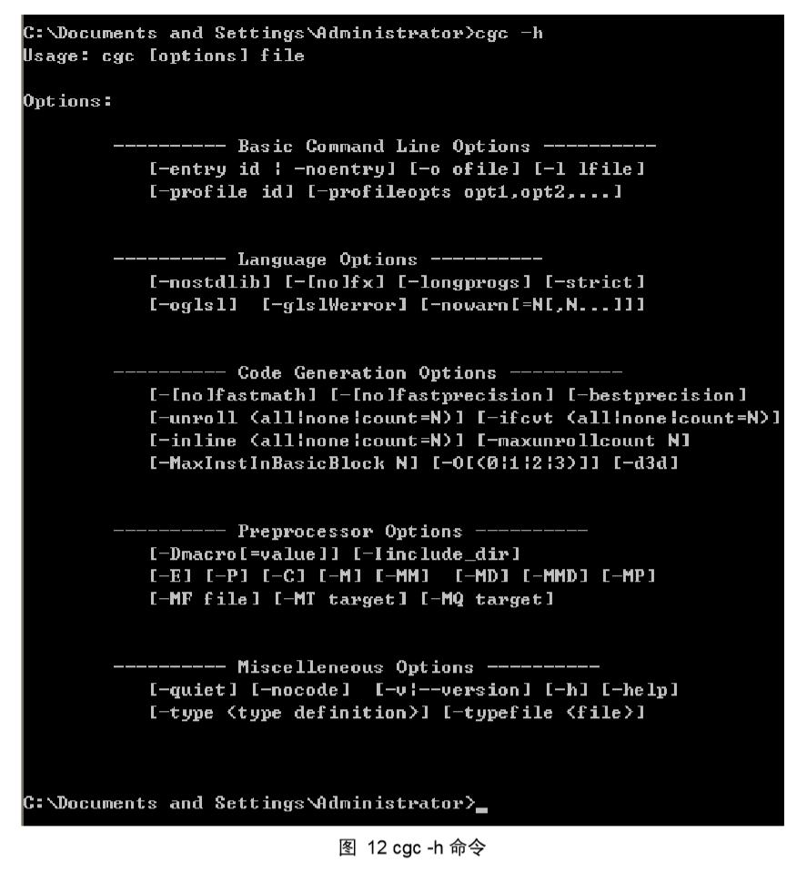

## 第04章  CG 语言概述
<br>

> 人们常觉得准备的阶段是在浪费时间，只有当真正机会来临，而自己没有能力把握的时候，才能觉悟自己平时没有准备才是浪费了时间。<br>
　　　　　　　　　　　　　　　　　　　　　　　　　　　　　　　　　　　------ 罗曼.罗兰

　　Cg（C for Graphcis）语言，是 NVIDIA 于 Microsoft 合作研发，旨在为开发人员提供一套方便、跨平台（良好的兼容性），控制可编程图形硬件的高级语言。Cg 语言的语法结构与 C 语言非常类似，使用 Cg 编写的着色程序默认的文件后缀是 *.Cg。
<br>

### 4.1 开启 Cg 之旅

　　在 NVIDIA 的 http://develpoer.nvidia.com/object/cg_toolkit.html 网页上下在 Cg Toolkit，截止到 2009 年 10 月，Cg 语言的版本为 2.2。下载之后直接安装即可。在安装目录的 bin 目录下一个可执行程序：cgc.exe。这是 NVIDIA 提供的 Cg 程序编译器。
<br><br>
　　目前还没有一个主流的专门为编写着色程序而开发的 IDE，很多人都是直接在文本写好程序后，然后将文件后缀改为 .cg。在网上有一个名为 NShader （http://nsshader.codeplex.com/） 的 Visual Studio 2008 插件，安装之后可以支持编写着色程序。图 11 展示了使用该插件之后的使用效果。
<br><br>

<br>

### 4.2 CG 特性

　　Cg 同时被 OpenGL 与 Direct3D 两种编程 API 所支持。这一点不但对开发人员而言非常方便，而且也赋予了 Cg 程序良好的跨平台性。一个正确编写的 Cg 应用程序可以不做任何修改的同时工作在 OpenGL 和 Direct3D 之上。
<br>

>以前编写 Shader 是非常痛苦的，尤其是作为跨平台渲染开发者，不同的渲染环境要写几套 Shader, GLSL、HLSL 等等，目前由于一些新兴的渲染环境增加导致 Shader 编写更加痛苦，所以聪明的开发这借鉴当下比较流行的中间语言方式，对 Shader 编程也做了 IL 化，日历目前大火且开源的 SPIRV，有兴趣的读者可以去 github 阅读一下源码。
<br>

### 4.3 CG 编译

>编译(compilation , compile)
1、利用编译程序从源语言编写的源程序产生目标程序的过程。
2、用编译程序产生目标程序的动作。 
通俗点理解其实编译就是把高级语言变成计算机可以识别的2进制语言，计算机只认识1和0，编译程序把人们熟悉的语言换成2进制的。
<br>

#### 4.3.1 CG 编译原理

　　前面提到的编译概念讲到计算机只能理解和执行由 0、1 序列（电压序列）构成的机器语言，所以汇编语言和高级语言程序都需要进行翻译才能被计算机所理解，担负这一任务的程序称为语言处理程序，通常也被称为编译程序。例如 C 或者 C++ 编写的程序，需要首先编译成可执行文件（.exe 文件），然后才能在 GPU 上运行，且一旦编译后，除非改变程序代码，否则不需要重新编译，这种方式称为静态编译（static compilation）。静态编译最重要的特征是：一旦编译为可执行文件，在可执行文件运行期间不再需要源码信息。而动态编译（dynamic compilation）与之相反，编译程序和源码都要参与到程序的运行过程中。
<br><br>
　　Cg 语言通常采用动态编译的方式，即，在宿主程序运行时利用 Cg 运行库（Cg Runtime Library）动态编译 Cg 代码，使用动态编译的方式，可以将 Cg 程序当做一个脚本，随时修改随时运行，节省大量的时间，在 OGRE 图形引擎中就是采用这样的方法。在文献【2】的 1.4.2 章节中提到 Cg 语言同样支持静态编译方式，即，Cg 源码编译成汇编代码后，这部分目标代码被链接到宿主程序最后的可执行程序中。使用静态编译的好处是只要发布可执行文件即可，源码不会被公开。
<br><br>
　　Cg 编译器首先将 Cg 程序翻译成可被图形 API（OpenGL 和 Direct3D）所接受的形式，然后应用程序使用适当的 OpenGL 和 Direct3D 驱动程序最后把他翻译成图形处理器所需要的硬件可执行格式。NVIDIA 提供的 Cg 编译器为 cgc.exe。
<br><br>
　　Cg 程序的编译不但依赖于宿主程序所使用的三维编程接口，而且依赖于图形硬件环境，因为图形硬件自身的限制，不一定支持某种 Cg 语句，例如，如果你所使用的 CPU 并不支持循环控制指令，那么在 Cg 程序中编写的循环控制语句将无法通过编译。被特定的图形硬件环境或 API 所支持的 Cg 语言子集，被称为 Cg Profiles。需要注意的是：profile 分为顶点程序的 profile 和片段程序的 profile，这是因为顶点着色器和片段着色器原本就不是工作在同一个硬件。
<br><br>
　　Cg Profile 是 Cg 语言的重要组成部分，在使用 Cg 语言编写着色程序时，首先要考虑的一点就是“当前的图形硬件环境支持哪个 Cg Profile”，这直接关系到您所编写的着色程序时否可以在当前的图形硬件上运行。
<br>

#### 4.3.2 CGC 编译命令

　　如果 Cg Toolkit 安装正确，在 NVIDIA Corporation\Cg\bin 文件夹下会看到 cgc.exe 文件。首先打开命令行窗口，输入 ***cgc -h***，如果安装正确，则会出现图 12 所示的提示信息。
<br><br>

<br>
　　Cg 程序编译的命令形式为：***cgc [options] file***
<br><br>
　　[options] 表示可选配置项，file 表示 Cg 程序文件名。可选配置项包括编译时选择使用 profile、着色程序的入口函数名称，以及着色程序文件名。比较典型的编译方式是：***cgc -profile glslv -entry main_v test.cg***
<br><br>
　　-profile 是 profile 配置项名；glslv 是当前所使用的 profile 名称；-entry 着色程序的入口函数名称配置项；main_v 是顶点着色程序的入口函数名；test.cg 是当前的着色程序文件名。编译器指定的着色程序入口函数名默认为 main，通常为了将顶点\片段着色程序入口函数名区别开来，而并不适用默认名称。在下面所有的例子中，main_v 表示顶点着色程序入口函数名，main_f 表示片段着色程序入口函数名。
<br><br>
　　 需要强调如下几点：
<br><br>
　　1. 着色程序分为顶点着色程序和片段着色程序，profile 也分为顶点 profile 和 片段 profile，所以编译顶点着色程序时必须选用当前图形硬件支持的顶点 profile，同理，编译片段着色程序时必须选用当前图形硬件支持的片段 profile。下面所示使用片段 profile fp20 编译顶点着色程序是不对的。
  ```c
    cgc -profile fp20 glslv -entry main_v test.cg
  ```
　　所以，如果您的着色程序中同时窜在顶点着色程序和片段着色程序，在编译前切记分别选择各自的 profile。<br><br>
　　2. 选择 profile 如果不被当前图形硬件所支持，编译时会出现错误。被编译的着色程序中，如果存在被被所选择的 profile 所支持的语句，则编译时会出现错误。例如，tex2D（sampler2D tex，float3 sz，float2 dsdx，float2 dsdy）不被 fp20 所支持，如果泥的编译形式为：
  ```c
    cgc -profile fp20 glslv -entry main_f test.cg
  ```
　　则会出现错误提示信息：
  ```c
    error c3004:function "tex2D" not supportd in this profile.
  ```
　　改为 fp30，进行编译就会通过。
  ```c
    cgc -profile fp30 glslv -entry main_f test.cg
  ```
　　尤其需要注意的是，循环语句 for, while 只被 vs_2_x, vp30, vp40, fp40 等少量的 profiles 所支持。在 CgUsersManual 中提到 “In other profiles， for and while loops may only be used if the compiler can fully unroll them （that is，if the compiler can determine the iteration count at compile time）”，这句话的意思是“在其他的 profiles 中，for 和 while 循环只有当确切的知道循环次数时才能被使用”。但经过试验，通常在其他 profile 编译含义 for， while 语句时会出现错误提示信息：
  ```c
    error c6003：instruction limit of exceeded......
  ```
　　因此，如果没有确切的把握，不要在低级的 profiles 中使用循环控制语句。<br><br>
　　3. 被编译的着色程序文件名必须加上 .cg 后缀。如果没有加后缀，写成如下的形式：
  ```c
    cgc -profile glslv -entry main_v
  ```
　　则会出现错误提示信息：
  ```c
    fatal error C9999：Can't open file:test
  ```
　　4. 另外 cgc 还提供一种比较特殊的功能：就是将 Cg 语言所写的着色程序转换为使用 GLSL 或 HLSL 所编写的程序。例如，将代码写成如下形式，表示编译文件 test.cg 中的顶点着色程序，入口函数名为 main_v, 并将顶点着色程序转换为 glsl 程序，然后保存成文件 direct.glsl。
  ```c
    cgc -profile glslv -o direct.glsl -entry main_v test.cg
  ```
　　5. 还有一个非常隐藏的编译情况是：如果着色程序中的某些变量并没有为最终的输出做出贡献，则编译时会将该部分代码忽略（会检查语法错误，但并不编译成汇编代码）。通常这一点不会造成太大的影响，但是如果这些变量刚好是从外部宿主程序中传入的变量，并且在着色程序中没有被使用，则宿主程序传入变量的接口函数可能会报错“找不到该变量”。这种情况比较少遇到，但并非不存在，且一旦遇上问题的原因难以查明，故而我在此写上，希望可以有所帮助。
<br><br>
　　基于 GPU 编程，最令人崩溃的一点是：无法跟踪调试着色程序！这一点目前还没有解决方案出现（对于iOS开发者如果用Metal开发的话到不会有这个苦恼，苹果真香~）。这一点到目前为止还没有好的解决方式出现（苹果的Metal是个案）。对于一个着色程序，语法错误可以通过编译器发现，而代码逻辑错误只能是人为查找。常会遇到这种情况，一段代码编译通过，但是运行结果不在预期之中，如果是 C++\JAVA 程序就可以进行跟踪调试，但是着色程序不能被调试，只能一行代码一行代码的进行逻辑分析。
<br><br>
　　所以，编译着色程序要非常注意逻辑的严密性，和代码的组织结构，这是为了更加容易的暴露错误和维护代码。一个良好的习惯是加入注释语句。
<br>

### 4.4 CG Profiles

　　Profile 在英文中意思是“侧面、轮廓”，文献【1】第三页写到：A Cg Profile defines a subset of the full Cg language that is supported on a particular hardware platform or API（CgUsersManual 21 页）。即一个Cg Profiles 定义了一个“被特定图形硬件或 API 所支持的 Cg 语言子集”，从前面的分析我们可以知道，任意一种 Shader Language 都是基于可编程图形硬件的（寄存器、指令集等），这也就意味着：不同的图形硬件对应着不同的功能子集。Profiles 按照功能可以划分为顶点 Profiles 和片段 Profiles，而顶点 Profiles 和片段 Profiles 又是基于 OpenGL 和 DirectX 的不同版本或扩展，划分为各种版本。从某种意义上而言，OpenGL 和 DirectX 的发展历程成就了 Cg 语言。
<br><br>
　　当前 Cg Compiler 所支持的 Profiles 有：
　　*OpenGL ARB vertex programs <br>
 　　Runtime Profile: CG_PROFILE_ARBVP1 
<br><br>


