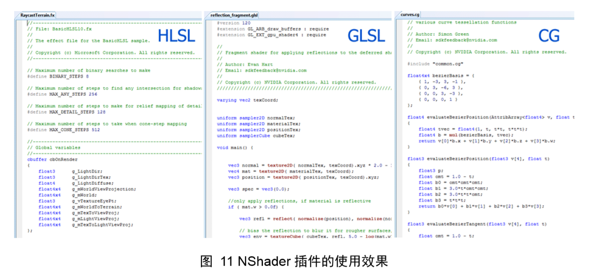

## 第04章  CG 语言概述
 

> 人们常觉得准备的阶段是在浪费时间，只有当真正机会来临，而自己没有能力把握的时候，才能觉悟自己平时没有准备才是浪费了时间。 
　　　　　　　　　　　　　　　　　　　　　　　　　　　　　　　　　　　------ 罗曼.罗兰

　　Cg（C for Graphcis）语言，是 NVIDIA 于 Microsoft 合作研发，旨在为开发人员提供一套方便、跨平台（良好的兼容性），控制可编程图形硬件的高级语言。Cg 语言的语法结构与 C 语言非常类似，使用 Cg 编写的着色程序默认的文件后缀是 *.Cg。
 

### 4.1 开启 Cg 之旅

　　在 NVIDIA 的 Http://develpoer.nvidia.com/object/cg_toolkit.html 网页上下在 Cg Toolkit，截止到 2009 年 10 月，Cg 语言的版本为 2.2。下载之后直接安装即可。在安装目录的 bin 目录下一个可执行程序：cgc.exe。这是 NVIDIA 提供的 Cg 程序编译器。
  
　　目前还没有一个主流的专门为编写着色程序而开发的 IDE，很多人都是直接在文本写好程序后，然后将文件后缀改为 .cg。在网上有一个名为 NShader （http://nsshader.codeplex.com/） 的 Visual Studio 2008 插件，安装之后可以支持编写着色程序。图 11 展示了使用该插件之后的使用效果。
  

 

### 4.2 CG 特性

　　Cg 同时被 OpenGL 与 Direct3D 两种编程 API 所支持。这一点不但对开发人员而言非常方便，而且也赋予了 Cg 程序良好的跨平台性。一个正确编写的 Cg 应用程序可以不做任何修改的同时工作在 OpenGL 和 Direct3D 之上。
 

>以前编写 Shader 是非常痛苦的，尤其是作为跨平台渲染开发者，不同的渲染环境要写几套 Shader, GLSL、HLSL 等等，目前由于一些新兴的渲染环境增加导致 Shader 编写更加痛苦，所以聪明的开发这借鉴当下比较流行的中间语言方式，对 Shader 编程也做了 IL 化，日历目前大火且开源的 SPIRV，有兴趣的读者可以去 github 阅读一下源码。
 

  
