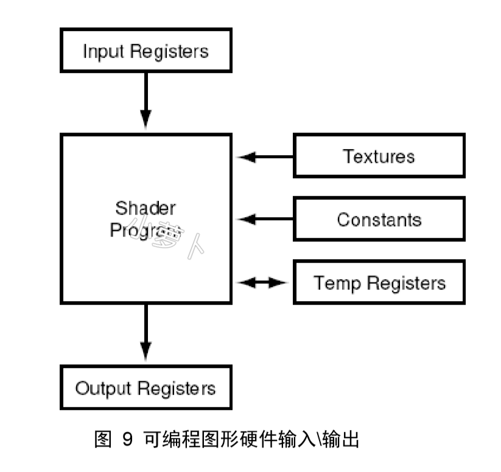

## 第07章  输入\输出与语义绑定

> 我们最大的弱点在于放弃。成功的必然之路就是不断的重来一次。<br>
　　　　　　　　　　　　　　　　　------ 托马斯·爱迪生

　　第三章从 GPU 运行原理和数据流程的角度阐述了顶点着色程序和片段着色程序的输入输出，即，应用程序（宿主程序）将图元信息（顶点位置、法向量、纹理坐标等）传递顶点着色程序；顶点着色程序基于图元信息进行坐标空间转换，运算得到的数据传递到片段着色程序中；片段着色程序还可以接受从应用程序中传递的纹理信息，将这些信息综合起来计算每个片段的颜色值，最后将这些颜色输送到真缓冲区（或颜色缓冲区）中。
<br><br>
　　这些是顶点着色程序和片段着色程序的基本功能和数据输入输出，实际上现在着色程序已经可以接受多种数据类型，并灵活的进行各种算法的处理，如，可以接受光源信息（光源位置、强度等）、材质信息（反射系数、折射系数等）、运动控制信息（纹理投影矩阵、顶点运动矩阵等），可以在顶点程序中计算光线的折射方向，并传递到片段程序中进行光照计算。
<br><br>
　　这一章节中，我们将讲解 Cg 语言通过何种机制确定数据类型和传递形式。读者要抱着如下几个问题阅读本章节：<br><br>
　　1. 从应用程序传递到 GPU 的数据，分为图元信息数据（在 GPU 处理的基本数据如顶点位置信息等）和其他的离散数据（在 GPU 运行流程中不会发生变化，如材质对光的反射、折射信息），这两种输入数据如何区分？<br>
　　2. 从应用程序传递到 GPU 中的图元信息如何区分类型，即，顶点程序怎么知道一个数据是位置数据，而不是法向量数据？<br>
　　3. 顶点着色程序与片段着色程序之间的数据传递如何进行？
<br>

### 7.1  Cg 关键字

　　关键字是语言本身所保留的一个字符串集合，用于代表特定的含义，如前面所讲到的数据类型关键字 int 、float 等，以及结构体关键字 struct。 Cg 中的关键字很多都是照搬 C\C++ 中的关键字，不过 Cg 中也创造了一系列独特的关键字，这些关键字不但用于指定输入图元的数据含义（是位置信息，还是法向量信息），本质也则对应着这些图元数据存放的硬件资源（寄存器或者纹理），称之为语义词（Semantics），通常也根据其用法称之为绑定语义词（binding semantics）。
<br><br>
　　除语义词外，Cg 中还提供了三个关键字，in、out、inout，用于表示函数的输入参数的传递方式，称为输入\输出关键字，这组关键字可以和语义词合用表达硬件上不同的存储位置，即同一个语义词，使用 in 关键字修饰和 out 关键词修饰，表示的图形硬件上不同的寄存器。
<br><br>
　　Cg 语言还提供两个修饰符：uniform，用于指定变量的数据初始化方式；const 关键字的含义与 C\C++ 中相同，表示被修饰变量为常量变量。
<br><br>
　　下面将分别对上述的关键字进行详细阐述。这一章非常关键，尤其是语义词的使用方法和含义，再小的 Cg 程序都需要使用到语义词。
  
### 7.2  uniform

　　Cg 语言输入数据流分为两类（参见文献【3】 Program Inputs and Ooutputs）：
　　1. Varying inputs, 即数据流输入图元信息的各种组成要素。从应用程序输入到 GPU 的数据除了顶点位置数据，还有顶点的法向量数据，纹理坐标数据等。Cg 语言提供了一组语义词，用以表明参数是由顶点的哪些数据初始化的。
　　2. Uniform inputs，表示一些与三维渲染有关的离散信息数据，这些数据通常由应用程序传入，并通常不会随着图元信息的变化而变化，如材质对光的反射信息、运动矩阵等。Uniform 修饰一个参数，表示该参数的值由外部应用程序初始化并传入；例如在参数列表中写：

 ```
　　uniform float brightness,
　　uniform float4x4 modelWorldProject
 ```
 　　表示从“外部”传入一个 float 类型数据，和一个 4 阶矩阵。“外部”的含义通常是用 OpenGL 或者 DirectX 所编写的应用程序。
<br><br>
 　　使用 Uniform 修饰的变量，除了数据来源不同外，与其他变量我是完全一样的。
<br><br>
 　　需要注意的一点是：uniform 修饰的变量的值是从外部传入的，所以在 Cg 程序（顶点程序和片段程序）中通常使用 uniform 参数修饰函数形参，不容许声明一个用 uniform 修饰的局部变量！否则编译时会出现错误提示信息：　

 ```
　　Error C5056：‘uniform’ not allowed on local variable
 ```
### 7.3  const

 　　Cg 语言也提供 const 修饰符，与 C\C++ 中含义一样，被 const 所修饰的变量在初始化之后不能再去改变它的值。下面的例子程序中有一个声明为 const 的变量被赋值修改：

 ```
　　const float a = 1.0;
　　a = 2.0; // 错误
　　float b = a++; // 错误
 ```
 　　编译时会出现错误提示信息：
 ```
　　error C1026: assignment to const variable.
 ```
 　　const 修饰符与 uniform 修饰符是相互独立的，对一个变量既可以单独使用 const 或者 uniform，也可以同时使用。

### 7.4  输入\输出修饰符（in\out\inout）

 　　参数传递是指：函数调用实参值初始化函数硬形参的过程。在 C\C++ 中，根据形参值的改变是否会导致实参值的改变，参数传递分为“值传递（pass-by-value）”和“引用传递（pass-by-reference）”。按值传递时，函数不会访问当前调用的实参，函数体处理的是实参的拷贝，也就是形参，所以形参值的改变不会影响是实参值；引用传递时，函数接收的是实参的存放地址，函数体中改变的是实参的值。C\C++ 采取指针机制构建引用传递，所以通常引用传递也称为“指针传递”。
<br><br>
 　　Cg 语言中参数传递方式同样分为“值传递”和“引用传递”，但指针机制并不被 GPU 硬件所支持，所以 Cg 语言采用不同的语法修饰符来区别“值传递”和“引用传递”。这些修饰符分别为：<br>
 　　1. in: 修饰一个形参只是用于输入，进入函数体时被初始化，且该形参值的改变不会影响实参值，这是典型的值传递方式。<br>
 　　2. out: 修饰一个形参只是用于输出的，进入函数体时并没有被初始化，这种类型的形参一般是一个函数的运行结果。<br>
 　　3. inout: 修饰一个形参既用于输入也用于输出，这是典型的引用传递。<br>
 　　举例如下：
 ```
　　void muFunc(out float x); // 形参x, 只用于输出
　　void muFunc(inout float x); // 形参x, 既用于输入时初始化，也用于输出数据
　　void muFunc(in float x); // 形参x, 只用于输入
　　void muFunc(float x); // 等价与 in float x，这种用法和C\C++完全一致
 ```
 　　也可以使用 return 语句来代替 out 修饰符的使用。输入\输出修饰符通常和语义词一起使用，表示顶点着色程序和片段着色程序的输入输出。
<br><br>
### 7.5  语义词（Semantic）与语义绑定（Binding Semantics）

 　　语义词，表示输入图元的数据含义（是位置信息们还是法向量信息），也表明这些图元数据存放的硬件资源（寄存器或者纹理缓冲区）。顶点着色程序和片段着色程序中 Varying inputs 类型的输入，必须和一个语义词相绑定，这称之为绑定语义（Binding semantics）。

#### 7.5.1  输入语义与输出语义的区别

 　　语义概念的提出和图形流水线工作机制大有关系。从前面所讲的 GPU 处理流程中可以看出，一个阶段处理数据，然后传输给下一个阶段，那么每个阶段之间的接口是如何确定的呢？例如：顶点处理器的输入数据是处于模型空间的顶点数据（位置、法向量），输出的是投影坐标和光照颜色；片段处理器要讲光照颜色做为输入，问题是“片段处理器怎么知道光照颜色值的存放位置”？
<br><br>
 　　在高级语言中（C\C++），数据从接口的一端流向另一端，是因为提供了数据存放的内存位置（通常是指针信息）；由于 Cg 语言并不支持指针机制，且图形硬件处理过程中，数据通常暂存在寄存器中，故而在 Cg 语言中，通过引入语义绑定（binding semantics）机制，指定数据存放的位置，实际上就是将输入\输出数据和寄存器做一个映射关系（在 OpenGL Cg Profiles 中是这样的，但在 DirectX-based Cg profiles 中则并没有这种映射关系）。根据输入语义，图形处理器从某个寄存器取数据；然后再将处理好的数据，根据输出语义，放到指定的寄存器。
<br><br>
　　记住这一点：语义，是两个处理阶段（顶点序、片段程序）之间的输入\输出数据和寄存器之间的桥梁，同时语义通常也表示数据的含义，如 POSITION 一般表示参数中存放的数据是顶点位置。
<br><br>
 　　语义，分为输入语义和输出语义；输入语义和输出语义是有区别的。虽然一些参数经常会使用相同的绑定语义词，例如：顶点 Shader 的输入参数，POSITION 指应用程序传入的顶点位置，而输出参数使用 POSITION 语义就表示要反馈给硬件光栅化的裁剪空间位置，光栅化把 POSITION 当成一个位置信息。虽然两个语义命名为 POSITION，但却对应着图形流水线上不同的寄存器。
<br>

| 说明：在 OpenGL Cg Profiles 中，语义绑定指定了输入\输出数据和图形硬件寄存器之间的对应关系；但是在 DirectX Cg Profiles 中，则并非如此。在文献【3】的第 25 页写到: <br><br>In the OpenGL Cg Profiles, binding semantics implicitly specify the mapping of varying inputs to particular hardware. Howerver, in DirectX based Cg profiles there is no such implied mapping.<br><br> 在文献【3】的第 260 页写到：<br><br> Often, these predefined names correspond to the names of hardware registers or API respurces. |
| :--- |

#### 7.5.2  顶点着色程序的输入语义

 　　图 13 所示的这组绑定语义关键字被 Cg 语言的所有 Vertex Profiles 所支持，一些 Profiles 支持额外的语义词。

<br><br>

<br>


<br><br>
<br><br>
#### 7.5.3  顶点着色程序的输出语义
<br><br>
<br><br>
#### 7.5.4  片段着色程序的输出语义
<br><br>
<br><br>
#### 7.5.5  语义绑定方法
<br><br>
<br><br>
